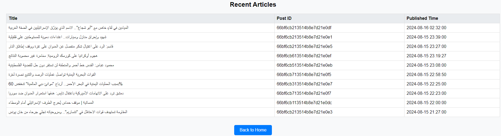

# Article Scraper

This Python project is designed to scrape articles from a website, parse their content, and store the data in a MongoDB database. It uses several libraries for web scraping, data processing, and concurrency.

## Features

- Fetch and parse sitemaps.
- Extract article metadata and content.
- Store article data in MongoDB.
- Concurrently process multiple articles for efficiency.

## Libraries

This project requires the following Python libraries:

- `requests`: For making HTTP requests to fetch web pages.
- `beautifulsoup4`: For parsing HTML and XML content.
- `json`: For handling JSON data.
- `pymongo`: For interacting with MongoDB.
- `tenacity`: For retrying operations with exponential backoff.
- `concurrent.futures`: For managing concurrent tasks.
- `subprocess`: For executing system commands.
- `dataclasses`: For defining simple data structures.

You can install these libraries using `pip`. Run the following command:

```bash
pip install requests beautifulsoup4 pymongo tenacity
```

## Generating JSON Files

After fetching and processing all articles from Al Mayadin, you can generate JSON files from MongoDB based on year and month. To do this, use the script `mongo_data_extractor_year_month.py`. This script will generate a directory called `allJson_files` containing all available JSON files for each year and month.

## Additional Scripts

- **`count_check_debugg`**: Use this script to count the number of available articles for each year and month at Al Mayadin. It works in conjunction with the `MongoDB_available_year_month_summary.py` script.

- **`MongoDB_available_year_month_summary.py`**: This script allows you to check all the years and months that have been crawled and stored in MongoDB. It provides a summary of available data based on year and month.

## Screenshots

### Application Overview

*The screenshot above shows the application interface with key features highlighted.*


### Detailed View

*screenshot2*

### Detailed View

*screenshot3*

### Detailed View

*screenshot4*

### Detailed View

*screenshot5*

### Detailed View

*screenshot6*

### Task2 

*screenshot7*

### Task2 

*screenshot8*

### Task2 

*screenshot9*