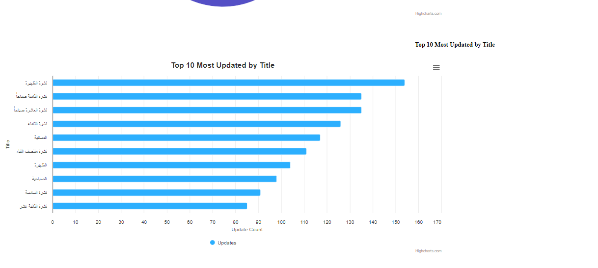
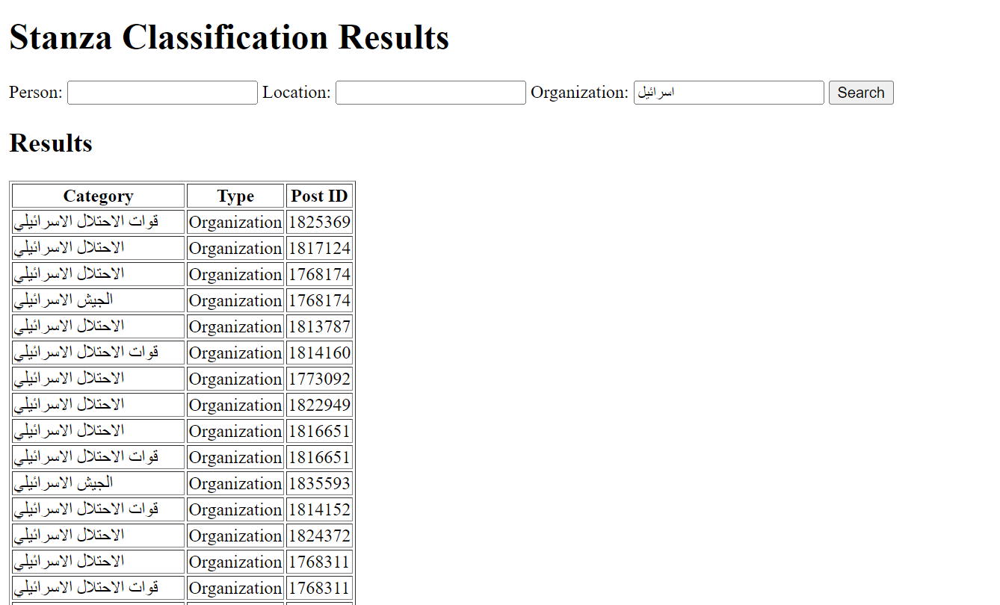

---

# Article Scraper

This Python project is designed to scrape articles from a website, parse their content, and store the data in a MongoDB database. It uses several libraries for web scraping, data processing, and concurrency.

## Setup Instructions

### Instructions to Download and Import MongoDB Data

1. **Download MongoDB Data:**
   - Visit the following link to download the MongoDB data files:  
     [MongoDB Data Download](https://drive.google.com/drive/folders/1a358PmOs79fVJGcU9VNN05YmB0cnEwK0?usp=sharing)
   - Download all the files from the link to your local machine.

2. **Import Data into MongoDB:**
   - Ensure you have MongoDB installed and running on your machine.
   - Open your terminal or command prompt and navigate to the directory where you downloaded the MongoDB data files.
   - Run the following command to import the data into a MongoDB database named `articles_db`:

   ```sh
   mongorestore --db articles_db /path/to/downloaded/files


## Features

- Fetch and parse sitemaps.
- Extract article metadata and content.
- Store article data in MongoDB.
- Concurrently process multiple articles for efficiency.

## Libraries

This project requires the following Python libraries:

- `requests`: For making HTTP requests to fetch web pages.
- `beautifulsoup4`: For parsing HTML and XML content.
- `json`: For handling JSON data.
- `pymongo`: For interacting with MongoDB.
- `tenacity`: For retrying operations with exponential backoff.
- `concurrent.futures`: For managing concurrent tasks.
- `subprocess`: For executing system commands.
- `dataclasses`: For defining simple data structures.

You can install these libraries using `pip`. Run the following command:

```bash
pip install requests beautifulsoup4 pymongo tenacity
```

## Sentiment Analysis

This project utilizes sentiment analysis to analyze the scraped articles. The sentiment analysis is performed using the **Khaled Analysis** library, which can be found [here](https://github.com/mervat-khaled/Arabic-Sentiment-Analysis/tree/main).

To implement this analysis:

1. **Training the Model**: A script named `training_setiment_ML.py` is used to train the sentiment analysis model.
2. **Running the Analysis**: After training, the model is converted from a Jupyter Notebook (`ipynb`) to a Python script named `2_khaled_ML_sentiment_analysis.py`. This script performs the sentiment analysis and stores the results in a new MongoDB collection.
3. **Handling Long-running Analysis**: To handle potential script freezes after extended use, a runner script (`run_analysis_analysisBykhaled_restart_it_each_2_min.py`) is created. This script runs `2_khaled_ML_sentiment_analysis.py` every 2 minutes to ensure all data receives sentiment analysis.

## Categorization

To categorize the content, this project uses **Stanza** for Named Entity Recognition (NER) to identify entities such as people, locations, and organizations. These entities are then stored in a new MongoDB collection for further analysis and use.

## JSON File Generation

After fetching and processing all articles from Al Mayadin, you can generate JSON files from MongoDB based on year and month using the script `mongo_data_extractor_year_month.py`. This script will create a directory called `allJson_files` containing all available JSON files organized by year and month.

## Additional Scripts

- **`count_check_debugg`**: Use this script to count the number of available articles for each year and month on Al Mayadin. It works in conjunction with the `MongoDB_available_year_month_summary.py` script.

- **`MongoDB_available_year_month_summary.py`**: This script provides a summary of all years and months that have been crawled and stored in MongoDB.

- **`main_scripts_forAll.py`**: A central script that runs all necessary scripts to keep data updated continuously. It also triggers another script, `web_scraper_uptodate_currentmonthonly.py`, to fetch the latest data from Al Mayadin for the current month.

## Flask Application Overview

The project includes a Flask application with two different scripts for handling the data:

- **`app1.py`**: This script uses crawled news data from Al Mayadin stored in JSON files to display the dashboard. It is designed to display historical data.
  
- **`app.py`**: This script reads directly from MongoDB to provide up-to-date data in the dashboard, ensuring that the latest news is displayed. JSON files are used only for accessing historical data.

- **`web_scraper_uptodate_currentmonthonly.py`**: A script used to fetch only the latest data for the current month, ensuring that the MongoDB database remains current.

This setup allows for efficient data management, balancing the need for real-time updates with the availability of archived news.


## Screenshots

### Application Overview

*The screenshot above shows the application interface with key features highlighted.*


### Detailed View

*screenshot2*

### Detailed View

*screenshot3*

### Detailed View

*screenshot4*

### Detailed View

*screenshot5*

### Detailed View

*screenshot6*

### Task2 

*screenshot7*

### Task2 

*screenshot8*

### Task2 

*screenshot9*

### Task2 

*screenshot10*

### Task2 

*screenshot11*

### Task2 

*screenshot12*


### Task2 

*screenshot13*

### Task2 

*screenshot14*


### Task2 

*screenshot15*


### Task2 

*screenshot16*


### Task2 

*screenshot17*

### Task2 

*screenshot18*

### Task2 

*screenshot19*

### Task2 

*screenshot20*

### Task2 

*screenshot21*

### Task4

*screenshot22*

### Task4

*screenshot23*

### Task4

*screenshot24*

### Task4

*screenshot25*

### Task4

*screenshot26*

### Task4

*screenshot27*

### Task4

*screenshot28*

### Task4

*screenshot29*

### Task4

*screenshot30*

### Task4

*screenshot31*

# Video Example google drive

Click on the image below to download the video:

[](https://drive.google.com/file/d/124v_v-DGkYFO_jD5XCeouFyC2V4x_uG-/view?usp=sharing)

# Video Example YouTube

Click on the image below to download the video:

[](https://youtu.be/_FGsKGiMJUI)
